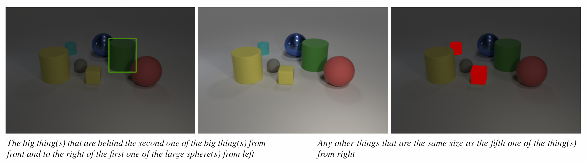

# CLEVR-Ref+ Dataset Generation

This is the code used to generate the CLEVR-Ref+ dataset. See our [paper](https://arxiv.org/abs/1901.00850):
```bash
@article{liu2019clevr,
  author    = {Runtao Liu and
               Chenxi Liu and
               Yutong Bai and
               Alan Yuille},
  title     = {CLEVR-Ref+: Diagnosing Visual Reasoning with Referring Expressions},
  journal   = {arXiv preprint arXiv:1901.00850},
  year      = {2019}
}
```

You can use this code to render synthetic images and referring expressions for those images, like this:
<div align="center">
  
</div>

All code was developed and tested on Ubuntu 16.04.

## Step 1: Generating Images
First we render synthetic images using [Blender](https://www.blender.org/), outputting both rendered images as well as a JSON file containing ground-truth scene information for each image.

Blender ships with its own installation of Python which is used to execute scripts that interact with Blender; you'll need to add the `image_generation` directory to Python path of Blender's bundled Python. The easiest way to do this is by adding a `.pth` file to the `site-packages` directory of Blender's Python, like this:

```bash
echo $PWD/image_generation >> $BLENDER/$VERSION/python/lib/python3.5/site-packages/clevr_ref+.pth
```

where `$BLENDER` is the directory where Blender is installed and `$VERSION` is your Blender version;

Second you need to download the [CLEVR 1.0 dataset](https://cs.stanford.edu/people/jcjohns/clevr/) which will be used to restore scenes and get annotations.

After you set the required paths in the following command, you can render some images like this:

```bash
cd image_generation

blender --background --python restore_render_images.py -- \
    --split train \
    --width 480 \
    --height 320 \
    --use_gpu 0 \
    --start_idx 0 \
    --num_images 10 \
    --clevr_scene_path /path/to/CLEVR_v1.0/scenes/CLEVR_train_scenes.json
```

If you have an NVIDIA GPU with CUDA installed then you can use the GPU to accelerate rendering. This requires you to modify the `--use_gpu` option.

After this command terminates you should have ten freshly rendered images stored in `output/images`.

The file `output/clevr_ref+_scenes.json` will contain ground-truth scene information for all newly rendered images.

## Step 2: Generating Referring Expressions
Next we generate referring expressions, functional programs, and ground-truth for the rendered images generated in the previous step.
This step takes as input the single JSON file containing all ground-truth scene information, and outputs a JSON file 
containing referring expressions, ground-truth, and functional programs for the referring expressions in a single JSON file.

After you set the required paths and parameters, you can generate referring expressions like this:

```bash
cd refexp_generation

python generate_refexp.py \
    --template_dir clevr_ref+_templates/ \
    --input_scene_file ../output/clevr_ref+_scenes.json \
    --output_refexps_file ../output/clevr_ref+_train_refexps.json \
    --num_scenes 10 \
    --scene_start_idx 0
```
The files `output/clevr_ref+_train_refexps_*.json` will then contain referring expressions for the generated images.


## Step 3(Optional): Generating Bounding Box/Segmentation Mask
After the first two steps, the bounding box and segmentation mask annotations are ready. One could additionally visualize them using the following commands.

```bash
cd refexp_generation

python get_box_mask_figure.py \
	--refexp_path ../output/clevr_ref+_train_refexps.json \
	--scene_path ../output/clevr_ref+_scenes.json \
	--img_dir_path ../output/images/ \
	--num_refexps 10 \
	--get_mask \
	--get_box 
```

